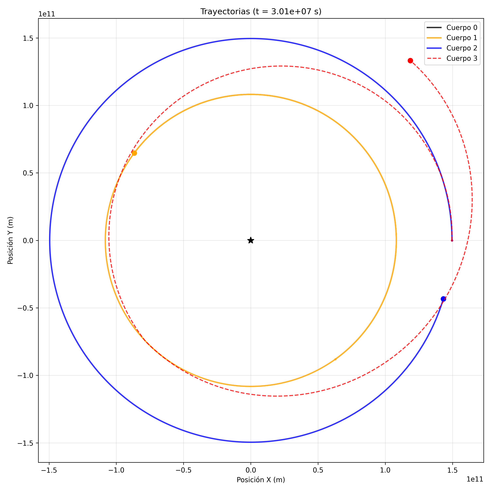
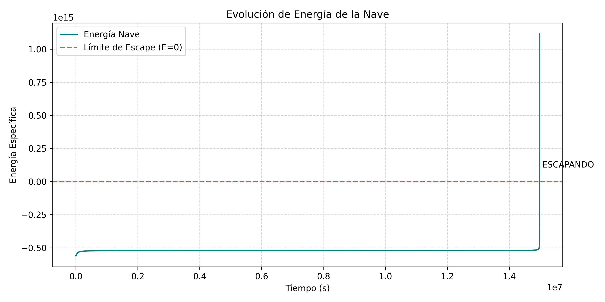

# Simulador de Asistencia Gravitatoria y Optimización de Trayectorias

Este repositorio contiene un motor de simulación astrodinámica
diseñado para analizar y optimizar maniobras de asistencia gravitatoria.

Está centrado específicamente en un modelo reducido del Sistema Solar, 
en el que se incluyen el Sol, la Tierra, Venus y la nave cuya velocidad
heliocéntrica se quiere maximizar.

## Plan de vuelo

Se realizará un análisis por medio de dos métodos distintos:

- Cálculo analítico: se aproximará a cónicas empalmadas (patched conics) y dispersión.
- Simulación numérica: integración directa, utilizando el algoritmo 
Runge-Kutta de orden 4, las ecuaciónes de movimiento para 4 cuerpos con
paso de tiempo adaptativo.

## Computación
### Modelo numérico
Se utiliza la mecánica Lagrangiana para obtener las ecuaciones de movimiento:
$$
\ddot {\vec r_i}=-\sum_{j\ne i}^nGM_j\frac{\vec r_i-\vec r_j}{\big|\vec r_i-\vec r_j\big|^3}
$$
Estas ecuaciones diferenciales no tienen solución analítica para el número de 
cuerpos en juego. Por ello, se utiliza el integrador Runge-Kutta de cuarto orden (RK4).

A esto se le añade la necesidad de salvar singularidades cuando se lleve a 
cabo la maniobra objeto de estudio. Para manejarlas como mejor se pueda, se utiliza 
un paso de tiempo adaptativo proporcional a la distancia entre la nave y el 
cuerpo más cercano a ella: 
$$
\delta t=\eta r_\text{min}
$$

### Validación del cálculo numérico
Para asegurar la precisión física de la simulación, el código
monitoriza el valor del Hamiltoniano del sistema. Así se verifica que 
el error numérico del integrador se mantiene acotado.

---
---
---
Tras unas pocas iteraciones manuales (por el momento la optimización 
no está automatizada), se obtienen las siguientes órbitas para 
una fase de Venus $\vartheta=5.3328\,\text{rad}$ y un empujón a la nave
que la frena $-4000\,\text{ms}^{-1}$ respecto a la Tierra, su punto de salida:

---

---

Con esta misma órbita, el cambio en el Hamiltoniano de la nave se ve reflejado 
en el entorno al instante en que se acerca a Venus:

---

---